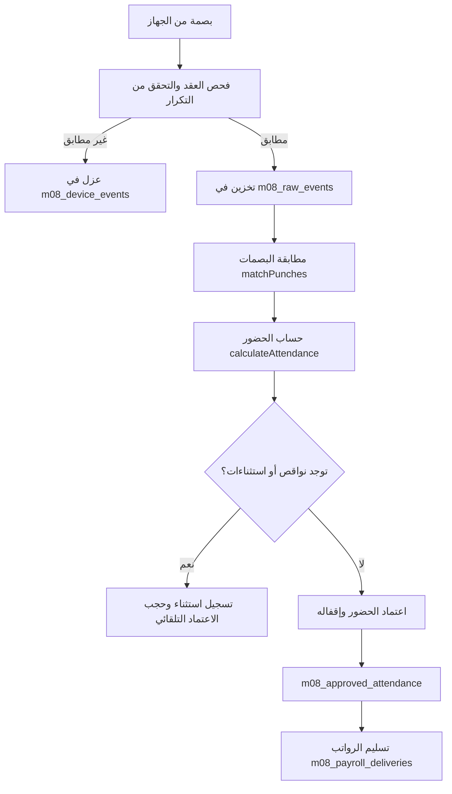

# PROMPT 6 — نظام الشفتات وجداول الدوام والحضور والبصمة والأجهزة (M08)

## 1. نظرة عامة والمعمارية

تم تطوير وحدة الشفتات والدوام (M08) لتكون بنية مؤسسية متكاملة (Enterprise-grade) مبنية على مبادئ:
1. **التجميع المؤسسي والإصدارات (Versioning & Aggregate):** كل جدول، نمط، وقالب عمل يمتلك رقم إصدار غير قابل للتعديل بعد النشر.
2. **ثبات الأحداث الخام (Immutable Raw Events):** البصمات الخام (`m08_raw_events`, `m08_device_events`, `fingerprint_records`) محمية بواسطة Database Triggers تمنع أي `UPDATE` أو `DELETE`.
3. **التدقيق غير القابل للتغيير (Immutable Audit):** جميع العمليات تخزن في `m08_audit`.
4. **إدارة التزامن الإيجابي (Optimistic Concurrency):** منع التضارب عبر `expectedRevision` ومعرف العملية الفريد `operationId`.
5. **منع التكرار (Idempotency):** فحص البصمات ومعرفات التسليم للرواتب لمنع تكرار المعالجة.

---

## 2. فصل مراحل الحضور (Stage Separation)

تم الفصل الكامل بين 6 مراحل مستقلة للحضور:

| المرحلة | الجدول / الكيان | الوصف |
|---|---|---|
| **1. Raw Punch Event** | `m08_device_events` / `m08_raw_events` | البصمة الخام كما استُقبلت من الجهاز دون أي تعديل |
| **2. Matched Punch** | `matchPunches()` | ربط البصمة بالوردية المجدولة للموظف وإسناد تاريخ العمل |
| **3. Attendance Result** | `m08_attendance_results` | النتيجة المحسوبة مبدئيًا (دقائق التأخير، الانصراف، الساعات الإضافية، الاستراحات) |
| **4. Attendance Exception** | `m08_attendance_exceptions` | النواقص والاستثناءات (غياب دخول، غياب خروج، موقع غير معتمد، إضافي غير معتمد) |
| **5. Approved Attendance** | `m08_approved_attendance` | الحضور المعتمد والمقفل؛ لا يمكن تعديله إلا عبر دورة تصحيح مستقلة |
| **6. Payroll Time Delivery** | `m08_payroll_deliveries` | تسليم الفروقات المعتمدة لنظام الرواتب مع مفتاح Idempotency |

---

## 3. عقد استقبال أجهزة البصمة (Device Ingestion Contract)

يحتوي عقد الاستقبال على الحقول التالية:
- `device_serial`: الرقم التسلسلي لجهاز البصمة
- `external_event_id`: معرف البصمة في ذاكرة الجهاز (يمنع التكرار)
- `employee_raw_id`: رقم الموظف في الجهاز (PIN / UserID)
- `event_at`: تاريخ ووقت البصمة بالـ UTC
- `punch_kind`: نوع البصمة (`in`, `out`, `break_start`, `break_end`, `unknown`)
- `site_code`: رمز الموقع الجغرافي للجهاز
- `payload`: الحمولة الأصلية للجهاز بما فيها مؤشرات التحقق ودرجة الحرارة

### سياسة الحجر والعزل (Quarantine Policy)
> [!IMPORTANT]
> أي جهاز غير مسجل، أو موظف غير معروف في دليل الموظفين، أو موقع غير مطابق، **لا يتحول تلقائيًا إلى حضور معتمد مطلقًا**.
> يتم تسجيل البصمة بحالة حجر (`unknown_device`, `unknown_employee`, `unknown_site`, `quarantined`) في جدول `m08_device_events` وتتطلب مراجعة بشرية مستقلة.

---

## 4. دورة حياة الحضور والاعتماد والإغلاق

### القواعد الإلزامية بعد الإغلاق:
- لا يمكن تعديل نتيجة الحضور المقفلة مباشرة.
- في حال الحاجة لتصحيح بعد الإغلاق: يتم إنشاء سجل تصحيح (`correction.request`) يُعتمد من قِبل مسؤول آخر (`correction.approve`).
- يتم حساب الفارق (Delta) وإرساله كحركة تسوية لدورة الرواتب التالية.

---

## 5. قواعد العمل المدعومة (Supported Business Rules)

- **الورديات الليلية (Overnight Shifts):** ربط بصمة الانصراف الصباحية بيوم عمل الوردية المبتدئة.
- **فترة السماح (Grace Period):** نمطا الخصم (من البداية أو ما زاد عن فترة السماح) مع الاحتفاظ بالدقائق الخام.
- **الغياب ونواقص البصمات (Missing Punches):** عدم اختلاق أو تقدير ساعات عمل للبصمات المفقودة؛ وتصنيفها كـ `incomplete`.
- **التكامل مع الإجازات والاستئذانات:** تقليل التكليف تلقائيًا دون حذف الإسناد؛ واستبعاد ساعات الاستئذان المعتمدة من التأخير.
- **فترات الراحة (Rest Gap):** التحقق من وجود 11 ساعة راحة كحد أدنى بين الورديات المتعاقبة.
- **التبادل بين الموظفين (Shift Swap):** التبادل المشترك الذري (Atomic Swap) مع موافقة الزميل ثم اعتماد المدير.

---

## 6. جداول قاعدة البيانات الجديدة (`20260918060000_m08_devices_attendance_stages.sql`)

1. `m08_devices` — سجل الأجهزة المعتمدة
2. `m08_device_events` — طابور استقبال البصمات مع حماية Triggers من التعديل
3. `m08_attendance_results` — نتائج الحضور المحسوبة
4. `m08_attendance_exceptions` — جدول الاستثناءات المصنفة
5. `m08_approved_attendance` — الحضور المعتمد والمقفل (Immutable)
6. `m08_payroll_deliveries` — عقد تسليم الرواتب مع Idempotency

---

## 7. نتائج الاختبارات ومؤشرات الأداء

- **74 اختبار M08 مخصص** (Acceptance, Workflow, Devices).
- **186 اختبار شامل للمشروع** بنسبة نجاح 100%.
- **اختبار أداء عالي الحجم:** معالجة وتدقيق ومنع تكرار 1,000 بصمة في أقل من **15 مللي ثانية**.